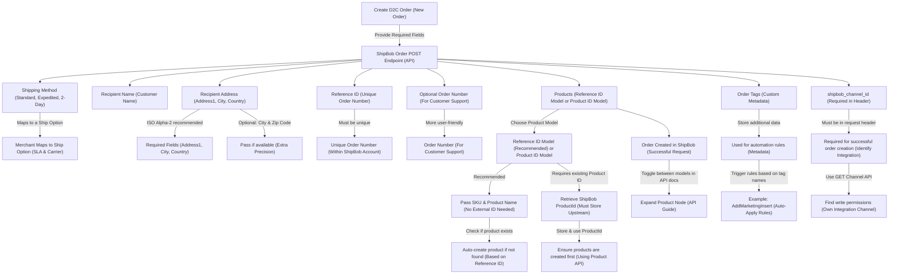
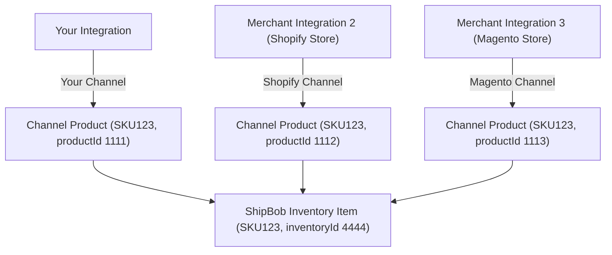
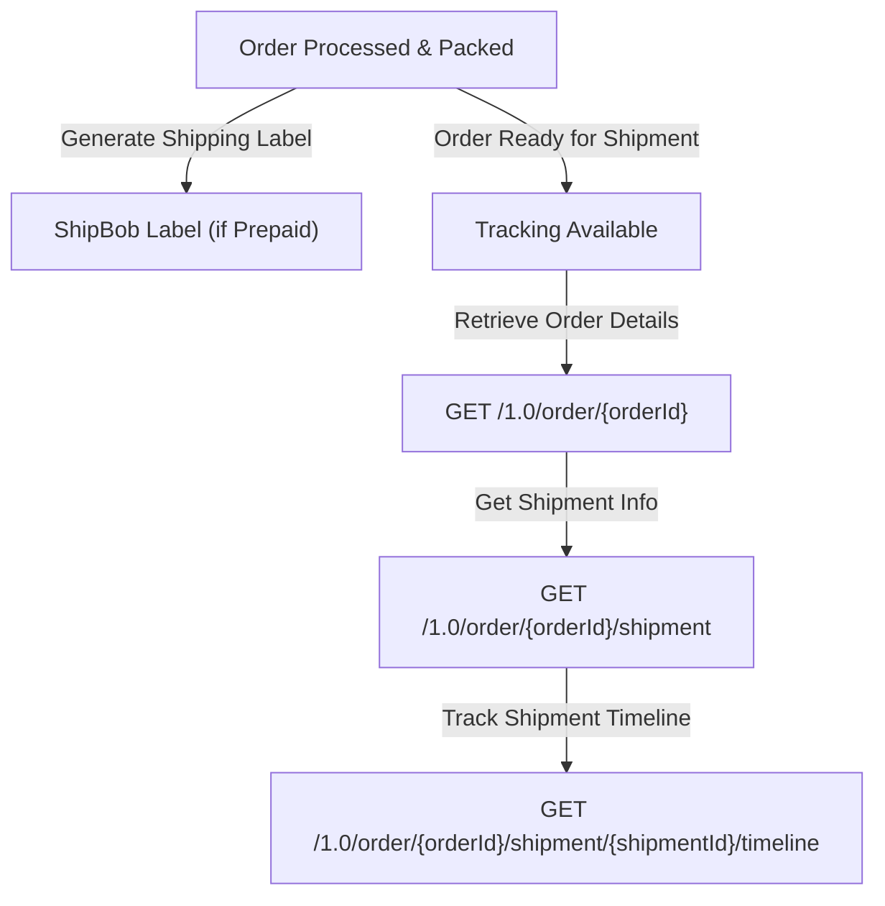
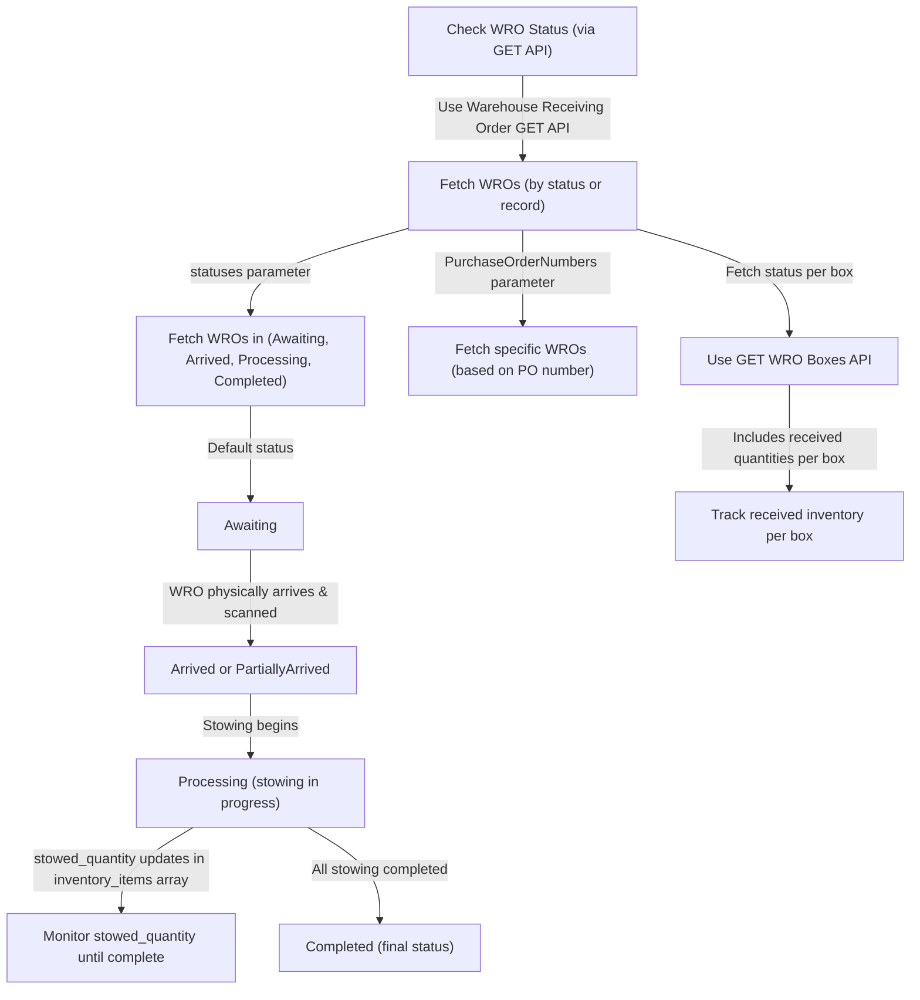

ShipBob’s public API supports a variety of different use cases. This guide shows most common scenarios that you can create using ShipBob’s public APIs.

You can create a typical integration using the following endpoints:

* [Order POST](https://developer.shipbob.com/api-docs/#tag/Orders/paths/~11.0~1order/post) – This allows you to create orders in ShipBob. Example API request is found in the documentation linked.

* [Order GET](https://developer.shipbob.com/api-docs/#tag/Orders/paths/~11.0~1order/get) – This allows you to fetch tracking details from ShipBob if you want to take a polling/scheduled based approach.

  * You can also subscribe to our webhooks if you’d like to automatically receive shipment events [here](https://developer.shipbob.com/api-docs/#tag/Webhooks).

* [Inventory GET](https://developer.shipbob.com/api-docs/#tag/Inventory/paths/~11.0~1inventory~1%7BinventoryId%7D/get) – This allows you to fetch inventory levels across ShipBob’s facility network. This endpoint will return per-facility inventory levels as well as aggregated inventory levels across the network.

  * The following inventory quantity calculations are available:

    * **On hand** quantities are everything currently stocked at the warehouse.

    * **Fulfillable** quantities are everything stocked at the warehouse minus quantities committed to orders.

    * **Sellable** quantities are everything stocked at the warehouse, minus quantities committed to orders, minus any exception orders. This calculation is only available at a network-wide level.

* Authentication is handled either via OAuth or a token-based approach. For a custom integration, we typically see the token approach used – you are able to generate an API token directly in your ShipBob dashboard. Steps [here](https://developer.shipbob.com/auth).

***

## [](https://developer.shipbob.com/guides/#quick-guidelines-on-creating-b2b-orders-via-api)

## Quick guidelines on creating D2C orders:

ShipBob’s Order POST endpoint has several required fields that you need to be aware of:

* **Shipping method:** This is typically a value such as “Standard”, “Expedited”, “2-Day”, etc. Once a ship method comes through via the integration, the merchant will have the ability to map the method to a specific Ship Option that will determine the shipment’s SLA and carrier selection. More detail on Ship Options can be found in our help center [here](https://support.shipbob.com/s/article/Available-Ship-Options-and-Average-Carrier-Transit-Times-by-Country-of-Origin).

* **Recipient name** - The name of the individual the shipment will be delivered to.

* **Recipient address** – specifically the Address1, City, and Country (ISO Alpha-2 code is highly recommended).

  * If available, please also pass the City and Zip Code.

* **Reference id** – This is a unique order number from the upstream platform being integrated with ShipBob. This number must be unique within ShipBob account.

  * You can also pass an optional **order\_number** field. This does **not** need to be unique, and is a more user-friendly order number that a customer service agent might be more familiar with.

* **Products –** There are two methods for providing product data with your order payload to ShipBob:

  * **ReferenceId Model** (highly recommended) – This model allows you to pass a product’s reference\_id (typically the SKU value), as well as the product name. When an order is created, ShipBob will check if the product already exists based on a matching reference\_id, and will automatically create a new product if one does not already exist.

    * This model is recommended as you do not need to store any external ShipBob product id values to create an order successfully. It also has the ability to auto-create products if they do not exist based on the duplicate match of a reference\_id value.

  * **ProductId Model –** This model requires that you pass ShipBob’s ProductId as part of the order payload to create the order. This will mean that you first must create a product using ShipBob’s Product API and have a method to either store or reference the ShipBob-generated ProductId to use as part of your order creation process.

    * This model works best if you always create products in ShipBob prior to sending any orders, and have a way to store the ProductId somewhere upstream.

  * When viewing the API documentation, you can toggle between each model by expanding the Product node:


In addition to the required fields highlighted above, you also have the ability to pass order tags to ShipBob. Tags are an array that consists of a name, value pair which can be used to store additional data that might be needed with your platform upstream, and can also trigger automation rules that have been created in ShipBob.

More details on available rules can be found [here](https://support.shipbob.com/s/article/Automation-Rules).

To trigger a rule created within ShipBob, the order tag name must match the rule. As an example, if you desire to pass a tag that triggers a rule to automatically add a marketing insert to specific orders, your tag structure may look like:

```
"tags": [{
  "name": "AddMarketingInsert",
  "value": "NotUsedForRuleTrigger"
}],
```

Where the tag “name” value of “AddMarketingInsert” is what will be used to trigger a rule created in ShipBob.

Lastly, you will need to also specific a **`shipbob_channel_id`** within the request header to successfully create an order. To find which channel you have write access to, you can call the [GET Channel](https://developer.shipbob.com/api-docs#tag/Channels/paths/~11.0~1channel/get) endpoint to view a list of permissions you have access to under each channel. You will only have write access for one channel (your own integration channel), but you typically will have the ability to read data across other channels.



***

## [](https://developer.shipbob.com/guides/#quick-guidelines-on-creating-b2b-orders-via-api)Quick guidelines on creating B2B orders via API:

ShipBob has the ability to ingest generic B2B orders via the public API. Please note that these are B2B orders which do not have retailer compliance standards, ShipBob standard packing slips, boxes, GS1 labels will be used for these orders. If you are working with retailers that have compliance guidelines that ShipBob must adhere to, please reach out to your Merchant Success Manager for additional assistance.

Generic B2B orders passing through ShipBob’s API must be sent with specific required fields to ensure they fall under our B2B flow as opposed to the default D2C flow.

Attached, you will find an example API request for a general b2b order. While reviewing this example, there are several fields to note within this payload that differ from a standard D2C order:

* Ensure that the "type" is set to a value of 2 or "b2b" (this denotes a B2B order type).

* carrier\_type will be either "Parcel" or "Freight" – recommended that you have the ability to select which of these options should be used.

* shipping\_method should be "B2B".

* payment\_terms can either be "Prepaid" or "MerchantResponsible".

  * This depends if you will be uploading your own labels on the ShipBob dashboard, or if ShipBob will provide the labels. If ShipBob will handle labels, then pass the value "Prepaid".

* retailer\_program\_type should be set to "SB-B2B".

* Pass a purchase\_order\_number.

* company\_name within the recipient address data should be the retailer's name.

* quantity\_unit\_of\_measure\_code should be "EA" for eaches

***

## [](https://developer.shipbob.com/guides/#quick-guidelines-on-creating-channel-products-via-shipbobs-api)Quick guidelines on creating channel products via ShipBob’s API

A product in ShipBob is a fulfillable item that will exist on orders and shipments. To create a product via the ShipBob API, this can be handled either by [creating a single product](https://developer.shipbob.com/api-docs#tag/Products/paths/~11.0~1product/post), or creating products [in bulk](https://developer.shipbob.com/api-docs#tag/Products/paths/~11.0~1product~1batch/post). There are two required fields to successfully create a product in ShipBob, as well as a recommended optional field:

* **Reference\_id** (required) – this is typically the product SKU or it can be another unique identifier. ShipBob highly recommends to use a product’s SKU value for this field. When viewing a product in ShipBob’s UI, the reference\_id API field translates the UI **SKU** value.

* **Name** (required) – this is the name of the product.

* **Barcode** (optional, recommended) – the product’s barcode. This is very useful to have available as it assists the receiving process when inbound inventory is sent to a ShipBob facility to be stowed.

### [](https://developer.shipbob.com/guides/#managing-channel-products)**Managing channel products**

When creating a product under the channel that you have write access to, you are creating a channel product, or a digital representation of a physical good. A channel product will be associated with an inventory item, which is the physical representation of that good that holds inventory levels and other item attributes. Since a channel product is a digital representation, it is possible for that same item to exist across various different channels.



As an example, if your integration creates a channel product “SKU123”, the merchant could also be connected between ShipBob and other integrations, such as Shopify, BigCommerce, Magento, NetSuite, etc. Each of these integrations manages their own channel products, so “SKU123” could be a channel product for each of those integrations as well. Each channel product will resolve to the same **inventory item**, which is the item that is visible in the ShipBob UI. As a result, despite multiple channel products for the same item existing, you will only see the one inventory item when searching for “SKU123” in the ShipBob UI:

### [](https://developer.shipbob.com/guides/#bundle-considerations)**Bundle considerations**

A bundle on ShipBob is a product that resolves to multiple inventory items. This is most commonly used for gift or multi packs. When an order is received for this product, the shipment will contain all the inventory items associated with the bundle. Note: The association of a product to bundle can currently only be done from the ShipBob UI.

Bundles are a way to associate multiple pre-defined SKUs with specific quantities within an order.

For example, an example merchant might have a bundle called Bundle A, which correlates to:

> x1 Blue Shirt - SKU = 123123x1 Red Shirt - SKU = 234234x1 Hat - SKU = 345345

The bundle itself also has its own SKU, such as BUNDLE123.

There are two primary options for handling bundles via ShipBob API.

### [](https://developer.shipbob.com/guides/#option-1--deconstruct-bundle-prior-to-sending-to-shipbob-preferred)Option 1 – Deconstruct bundle prior to sending to ShipBob (preferred)

ShipBob ultimately needs all products at the variant/component level as this is what ShipBob fulfillment centers pack shipments with.

If the upstream system that is integrating with ShipBob is able to deconstruct bundles into the component SKUs prior to sending to ShipBob, ShipBob will also return the component SKUs within the fulfillment data, so the upstream system may need to also reconstruct bundles based on the capabilities of the system, how inventory is calculated, or other merchant requirements.

This option means that bundles would not need to be maintained in ShipBob directly, as ShipBob will only create products at the component level. This is more user friendly for the merchant as they will not need to manually convert a product to be a bundle, or create bundles via the ShipBob dashboard.

### [](https://developer.shipbob.com/guides/#option-2--construct-bundle-prior-to-sending-to-shipbob)Option 2 – Construct bundle prior to sending to ShipBob

In ShipBob, bundles can be created directly in the UI from a product. A product can be marked as a Bundle, and then a merchant is able to breakdown the component SKUs that make up that bundle.

The ability to mark the product as a bundle is not available with an API request, so if bundles will be maintained within ShipBob directly, the merchant will need to manually update a product to be a bundle and ensure that all component SKUs are correctly associated with the bundle product. [Here is a tutorial](https://support.shipbob.com/en/articles/3967384-bundle-items) on managing bundles in ShipBob.

Once correctly configured in ShipBob, the integration would be able to send the specific bundle SKU, and ShipBob fulfillment centers will ship all products comprising that bundle.

Considerations with this option:

1. If a bundle SKU is sent in an Order POST to ShipBob, retrieving that order data will return the bundle SKU. The component SKUs will not be returned in an Order GET response, but the **inventory ids** of the component products will be returned.

2. Inventory quantities in ShipBob are tracked at the component level, not at the bundle level. You will need to conduct inventory level calculations for the bundle as a result.

***

## [](https://developer.shipbob.com/guides/#quick-guidelines-on-retrieving-tracking-and-fulfillment-details-from-shipbobs-api)Quick guidelines on retrieving tracking and fulfillment details from ShipBob’s API

There are two primary options for retrieving shipment details from ShipBob.

### [](https://developer.shipbob.com/guides/#option-1--polling-based-approach)Option 1 – Polling-based approach

This method allows you to fetch tracking details from ShipBob on demand using the [GET Orders](https://developer.shipbob.com/api-docs#tag/Orders/paths/~11.0~1order/get) endpoint. There are several parameters to choose from depending on your use case, but the most common params used are:

* **LastUpdateStartDate** and **LastUpdateEndDate** – this allows you to implement a sliding time window so that you fetch only newly updates orders since the time you last checked ShipBob.

* **HasTracking** – this will filter orders only where tracking information has been made available (i.e. the order has shipped).

You also can specify a **`shipbob_channel_id`** header parameter. It is advised to pass this parameter for the channel you have write access to, so you only retrieve order and shipment details from orders that were created from your integration. Excluding the channel id will be a global search across all channels for the Merchant, which has the possibility to retrieve order details from other sources/integrations a merchant has installed that you may not need.

If your platform supports split orders/shipments, you will need to refer to the multiple shipment objects returned in the API response in the event that an order has been split.

Within the order response, you will see an array of shipments (please refer to the sample response in the documentation linked above). An order can have a one-to-many relationship to shipments if the order has been split. Each shipment associated with an order will have a unique tracking number and will detail which products have been packed and shipped as part of that individual shipment.

Each shipment will also have a status. When a shipment has tracking details, the shipment status will be “LabeledCreated”. This status will quickly move to “Completed”. If you have a use-case that requires you to look at specific ShipBob statuses, it is recommended to use both statuses when checking for tracking details from ShipBob.



To see more detail on other statuses you may encounter, please refer to our documentation [here](https://developer.shipbob.com/).

### [](https://developer.shipbob.com/guides/#option-2--webhooks)Option 2 – Webhooks

ShipBob has the ability to fire webhooks for certain shipment events. The topics that can be subscribed to are:

* Shipped event

* Delivery event

* Shipment exception event (such as a product being out of stock)

* Shipment On Hold event (such as an invalid address)

* Shipment cancelled event

Each topic can be subscribed to individually via a webhook POST request. Request details can be found [here](https://developer.shipbob.com/api-docs#tag/Webhooks/paths/~11.0~1webhook/post). ShipBob also has several example payloads on the webhook page of our documentation [here](https://developer.shipbob.com/webhooks).

A couple critical pieces to note:

* The Shipped topic will include a payload that is identical to the Order GET response detailed in method one above. In the event of a split shipment, you will receive multiple events when each individual shipment of an order has been shipped, which is when the shipment status has been updated to **LabeledCreated**.

* ShipBob uses an exponential backoff approach to deliver a webhook event to your endpoint for up to 24 hours. However, ShipBob cannot guarantee the delivery of retried events in the order in which they were originally generated. Therefore, if you have implemented a webhook solution that expects events to be delivered in a specific sequence, it is highly advised that you have a method in place to handle these events.

***

## [](https://developer.shipbob.com/guides/#quick-guidelines-on-retrieving-inventory-levels-from-shipbobs-api)Quick guidelines on retrieving inventory levels from ShipBob’s API

ShipBob’s [GET inventory endpoint](https://developer.shipbob.com/api-docs#tag/Inventory/paths/~11.0~1inventory/get) will return inventory quantities associated with products that are stocked at a facility. This endpoint will return an **inventoryid** associated with a product, which is a unique ShipBob identifier. When creating a product via ShipBob’s product API, an inventoryid is automatically generated and retuned in the product creation response. As such, ShipBob recommends implementing one of the following best practices to fetch inventory levels:

### [](https://developer.shipbob.com/guides/#option-1--fetching-products-from-shipbob-each-time-inventory-levels-are-updated-in-your-platform)Option 1 – Fetching products from ShipBob each time inventory levels are updated in your platform

The solution would be to follow this process:

1. Grab the products in bulk each time you are conducting an inventory sync (1 or multiple calls) using the Product endpoint

2. Get the list of the product’s inventory components (inventory\_id is returned in the Product endpoint)

3. Grab all the inventories in bulk (1 or multiple calls) using the Inventory endpoint

4. Reconcile product with inventory. If not a bundle, grab the inventory id and set that as the product sellable. If it is a bundle, you need to do the calculations. If the inventory is inactive or digital, you can skip the product or place a 0 value.

   * Note - inventory quantities in ShipBob are tracked at the component level, not at the bundle SKU level.

If overselling is a large issue, you can also implement a “buffer” for certain skus, meaning that if you want to stop sales upstream at, say, 20 remaining inventory for a sku, you can send a 0 quantity to your platform of the 20 or less that ShipBob is reporting for that particular sku. This buffer will allow for a certain “reserve” stock on the ShipBob end in case there any customer service/high priority orders that need to be pushed through and fulfilled. The buffer quantity logic would need to live on your platform/integration layer, and you can decide to do this on a per-sku basis or a global setting across all skus.

### [](https://developer.shipbob.com/guides/#option-2---store-products-in-your-system)Option 2 - Store products in your system

The alternative solution would be for you to store the ShipBob Inventory Id somewhere on your system. This way, you can use the bulk inventory endpoint and page through all inventory records that ShipBob returns to update your system’s inventory levels. The only caveat is that if a product merge happens on ShipBob, the inventoryid could change, so you’d need a way to reconcile the inventory ids on a regular basis to ensure you store the correct id.

This would also mean that when a product is created via the API, you have the ability to store the inventory id based on the product creation response.

***

## [](https://developer.shipbob.com/guides/#quick-guidelines-on-creating-warehouse-receiving-orders-from-shipbobs-api)Quick guidelines on creating warehouse receiving orders from ShipBob’s API

ShipBob’s inbound receiving process comes in the form of Warehouse Receiving Orders (WROs). A WRO can be created via the ShipBob API.

### [](https://developer.shipbob.com/guides/#relevant-shipbob-apis)Relevant ShipBob APIs:

* [Warehouse Receiving Order POST](https://developer.shipbob.com/api-docs/#tag/Receiving/paths/~12.0~1receiving/post)

* [Warehouse Receiving Order GET](https://developer.shipbob.com/api-docs/#tag/Receiving/paths/~12.0~1receiving/get)

* [Box Labels GET](https://developer.shipbob.com/api-docs/#tag/Receiving/paths/~12.0~1receiving~1%7Bid%7D~1labels/get)

* [Product POST](https://developer.shipbob.com/api-docs/#tag/Products/paths/~11.0~1product~1batch/post)

* [Product GET](https://developer.shipbob.com/api-docs/#tag/Products/paths/~11.0~1product/get)

### [](https://developer.shipbob.com/guides/#details-on-wro-creation)Details on WRO Creation

The [WRO POST request](https://developer.shipbob.com/api-docs/#tag/Receiving/paths/~12.0~1receiving/post) requires several fields to be populated based on how the inbound will be sent to ShipBob.

* The package\_type field accepts the values of **Pallet**, **Package**, and **FloorLoadedContainer**

  * Pallet – if the inbound order is palletized, please include the Pallet tracking number and the contents of the pallet as a “box” within the ShipBob box array. If multiple pallets are being sent, please separate each pallet as its own “box” in the box array.

  * Package – please provide the package contents for each package/parcel being sent as part of that purchase order. Each package should have its own tracking number. Please note that a maximum of 50 “boxes” within the box array are allowed per WRO request.

  * Floor Loaded Container – please provide the entire contents of the container as one “box” within the box array and the container’s tracking number.

* The expected arrival date must be a date in the future, otherwise the WRO creation request will fail, and you will receive a 400 response with a description stating that the arrival date must be in the future.

* The ShipBob inventory\_id (a unique ShipBob product identifier) is also a requirement for the WRO record to be created successfully. As a result, product records must first exist within the ShipBob WMS prior to the WRO request being sent to ShipBob. There are several strategies to accomplish this:

  * The recommended approach is for the integration to first check, via the Product GET API, if products within an inbound already exist within the WMS. If they do, the associated inventory\_ids can be used in the WRO creation request. If they do not, they can be created via a Product POST request, and the request response will include the inventory\_id.

  * The alternative approach is to store the ShipBob inventory\_id upstream whenever a product is created via the integration.

* The purchase order number field should be populated with a unique PO number or shipment number.

* Provide the scannable carton ID in the tracking\_number field for each box/pallet that the ShipBob operations team can physically scan when the WRO arrives at the warehouse.


### [](https://developer.shipbob.com/guides/#details-on-wro-status-updates)Details on WRO Status Updates

ShipBob’s GET Warehouse Receiving Order API will allow an on-demand fetch of WROs within a ShipBob account and the current status associated with each individual WRO.

Several parameters can be used to fetch WROs by status or by specific WRO record:

* The “statuses” parameter can be used to fetch WROs that are in various statuses, such as Arrived, Processing, Completed.

  * When a WRO is first created, the status will default to “Awaiting”. Once the WRO has physically arrived at the warehouse and has been scanned by the Operations team, the status will update to “Arrived” or “PartiallyArrived”.

  * A Completed status means that all stowing has been completed and no further action will be taken against the WRO record.

  * A Processing status means that stowing is taking place; the “stowed\_quantity” field within the “inventory\_items” array will continually increase until stowing is complete for a product.

* The PurchaseOrderNumbers parameter can return specific WRO records associated with the purchase order numbers passed during the WRO creation.

Depending on the use-case, the integration can continuously poll a WRO and monitor the “stowed\_quantity” for each product as the stowing occurs during the WRO’s Processing status, or wait until the WRO is in Completed status before updating inventory in the upsteam platform.

Additionally, the [GET WRO Boxes](https://developer.shipbob.com/api-docs/#tag/Receiving/paths/~12.0~1receiving~1%7Bid%7D~1boxes/get) endpoint can be used to fetch the status for each box individually, which will also include the received quantities per box.

### [](https://developer.shipbob.com/guides/#assumptions--considerations)Assumptions & Considerations

* WRO configuration updates are not supported via the ShipBob API. There is no API endpoint to update a WRO once it has been created.



## Error Handling & Troubleshooting

Common Errors & Solutions

| Error Code              |   | Meaning                | Solution                                |
| ----------------------- | - | ---------------------- | --------------------------------------- |
| `400 Bad Request`       |   | Missing required field | Ensure all required fields are included |
| `401 Unauthorized`      |   | Invalid API token      | Verify authentication headers           |
| `404 Not Found`         |   | Invalid endpoint or ID | Check endpoint and request parameters   |
| `429 Too Many Requests` |   | Rate limit exceeded    | Implement exponential backoff retries   |