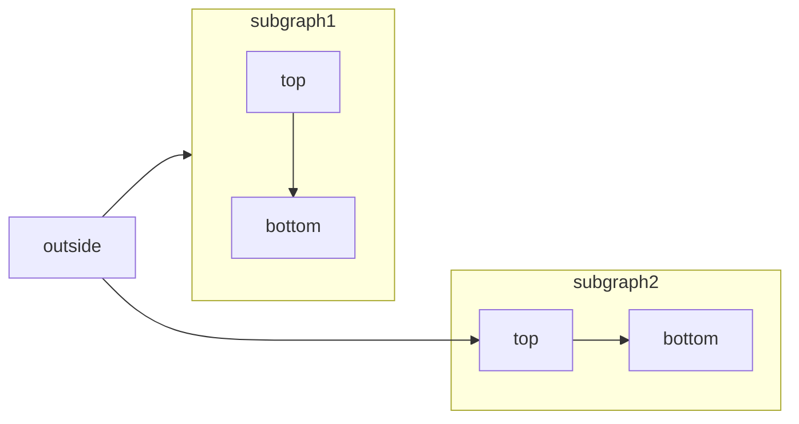
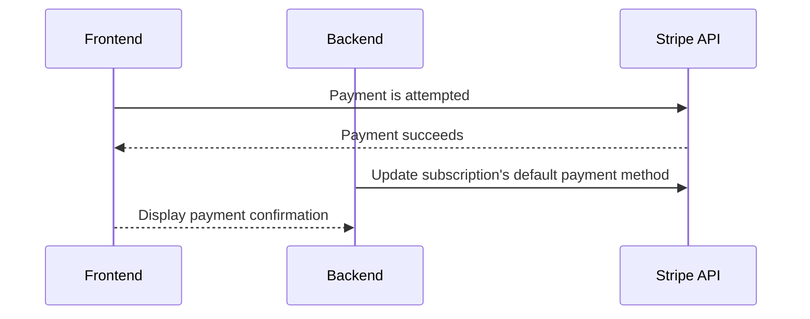

## Sandbox/Test Accounts

Every ShipBob account starts in "demo mode" and you can cancel orders that do not have physical inventory assigned. So it's possible to test in a production account. If you don't have an account yet, you can sign up for one [here](https://web.shipbob.com/app/merchant/#/SignUp).

However, if you want to simulate more complex operations you can use our new Sandbox API. Please sign up for an account, then request sandbox credentials using the same form you used to request API access (on the home page of this site).

<Note>Click the "clear demo data" step on the onboarding page before sending test orders.</Note>

## Certified Third Party Libraries for OAuth flow

You can find open source OAuth libraries for hybrid flow [here](https://openid.net/developers/certified/#RPLibs)

## Example Integration Diagrams

### Personal Access Token Flow

### OAuth Flow

## Getting Support
The fastest way to get support with your integration is to contact [developers@shipbob.com](developers@shipbob.com) with a detailed description of your issue or question (request samples encouraged if relevant!)

